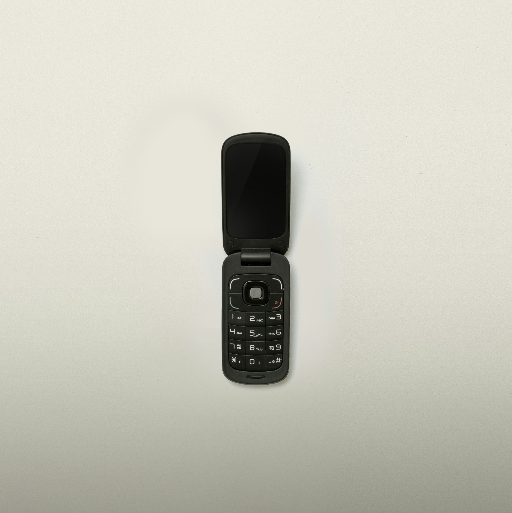
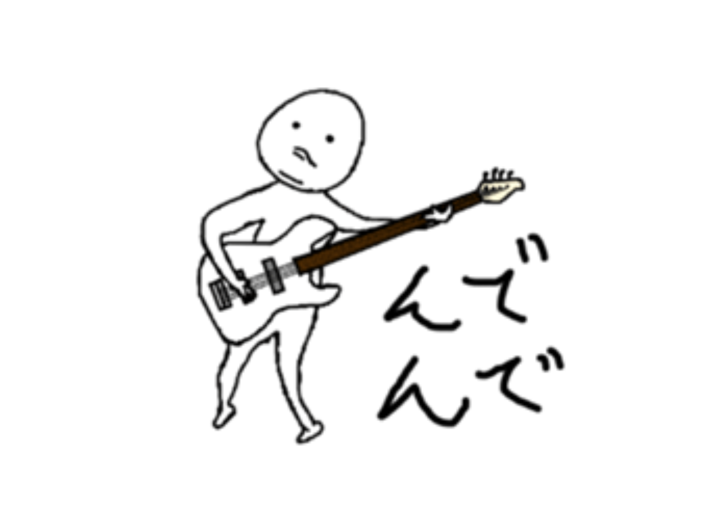

# I made LINE animated stickers with SVG and JavaScript.

概要:まず SVG を dataURI に変換し canvas に drawImage で描写します。getImageData でピクセルデータを得た後、UPNG.js を使って アニメーション png ファイルを作ります。もう二度とやりたくありません。

## What is LINE?

あなたは LINE というアプリを知っていますか？

https://line.me/en/

LINE について聞いたことがない人もいるかも知れません。NAVER にルーツを持ち、今は LY によって運営されているメッセンジャーアプリです。Telegram や WhatsApp などと比べてダウンロード数も少ないマイナーなようです。そもそも Facebook のような SNS のみ使用して、このようなアプリは不必要だと考えている人も多いのではないでしょうか。

https://www.statista.com/statistics/1263360/most-popular-messenger-apps-worldwide-by-monthly-downloads/

しかし、ほぼ全ての国民が LINE を使っている国があります。それは、私の母国である日本です。

なぜこんなにも人気があるのでしょうか？LINE は東日本大震災の後、電話が繋がらなくなった場合の代替を目的として開発されたそうです。私も記憶していますが、その頃日本は旧式の携帯電話から現在のスマートフォンへと移行が進んでおり、その波に上手く乗った印象があります。

日本人は個人情報をインターネット上に公開することに抵抗があり、閉じた関係性の人のみとチャットで連絡が取れる LINE はすぐに受け入れられて、現在も多くの日本人に使われています。

## What is LINE stickers?

私は LINE の最大の魅力はスタンプ(Sticker)機能だと思っています。とても可愛らしくて個性のあるスタンプがたくさんあり、スタンプを送り合うコミュニケーションはとても楽しいです。いいスタンプを見つけたらショップから購入することで使用することができるようになります。

https://store.line.me/stickershop/showcase/top/en

実はこのスタンプは企業が作っているものだけではなく、個人で作っているものも数多くあります。個人で作った場合も同じように公式ショップで販売することが可能で販売数に応じた収益を得られるようになります。

私は 7 年ほど前に LINE スタンプを作成し、販売しました。

https://store.line.me/stickershop/product/1444071/en

私はベースを少しばかり演奏できるのですが、ベーシストが使えるスタンプが欲しくなり作成しました。ベーシストはアゴでリズムをとる人が非常に多いのです。

私は iPad のような高級品を持っていなかったので、[FireAlpaca](https://firealpaca.com/en)というドローソフトと 1 個のマウスで 40 枚の絵を描きました。拙い絵ですが、かなり大変だったことを覚えています。

このスタンプはこのクオリティですが、毎月 0.2 ドル程度の収益が上がっています。極めて少額ではありますが、維持管理等を一切せずに自動的に収益を上げ続けてくれます。これはすごいことです。

私がこれを売り出した時期ぐらいに、動くスタンプを作ることができるようになりました。せっかくアゴでリズムをとるベーシストなのだから、実際にアゴが動く姿も見てみたいと考えるようになりました。

しかし、
